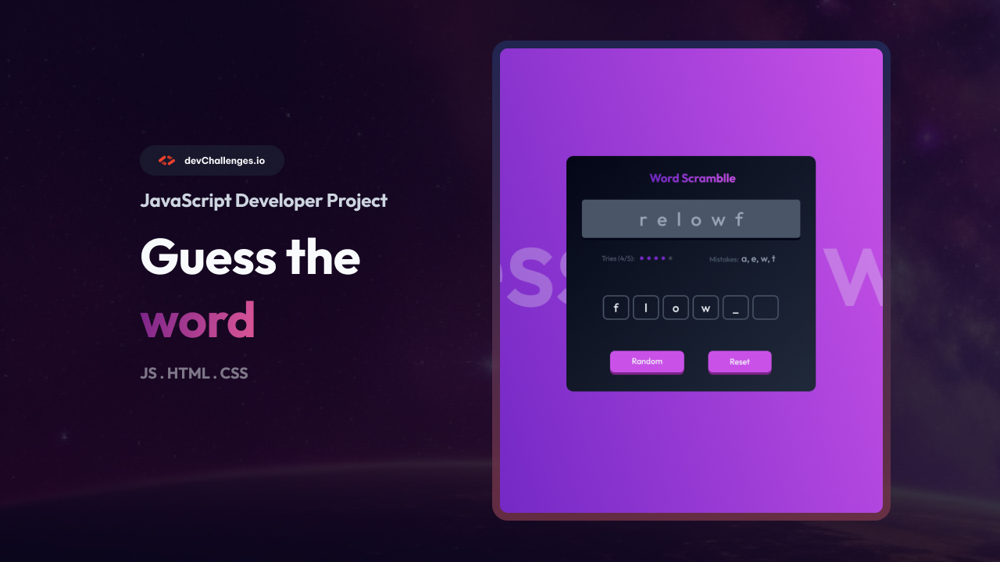

<!-- Please update value in the {}  -->

<h1 align="center">Guess The Word Game | devChallenges</h1>

   Solution for a challenge <a href="https://devchallenges.io/challenge/guess-the-word" target="_blank">Guess The Word Game</a> from <a href="https://devchallenges.io" target="_blank">devChallenges.io</a>.

  <h3>
    <a href="https://zm404notfound.github.io/guess-the-word-master/">
      Demo
    </a>
     | 
    <a href="https://github.com/zm404notfound/guess-the-word-master">
      Solution
    </a>
     | 
    <a href="https://devchallenges.io/challenge/guess-the-word">
      Challenge
    </a>
  </h3>

<!-- TABLE OF CONTENTS -->

## Table of Contents

- [Overview](#overview)
  - [What I learned](#what-i-learned)
  - [Useful resources](#useful-resources)
- [Built with](#built-with)
- [Features](#features)
- [Contact](#contact)
- [Acknowledgements](#acknowledgements)

<!-- OVERVIEW -->

## Overview

A small “Guess the Word / Word Scramble” game built for the devChallenges.io challenge.  
On load (or on **Random**), a word is scrambled and displayed. The player inputs one letter per field. The app tracks wrong attempts (**Tries**) and shows wrong answers (**Mistakes**). The game resets at **6** tries or **6** mistakes and shows **“🎉 Success”** on completion.

- Live Demo: **add your URL**
- Repository: **add your repo URL**

### What I learned

- DOM manipulation and dynamic UI rebuild (recreate inputs when the word length changes)
- Managing simple game state in Vanilla JS (tries, mistakes, result messages)
- Keyboard UX: auto-focus to next input, Backspace to previous
- Off-by-one pitfalls (using `< 6` vs `<= 6`)
- Keeping UI state consistent on resets (inputs, counters, progress bar)

### Useful resources

- MDN – [`addEventListener`](https://developer.mozilla.org/en-US/docs/Web/API/EventTarget/addEventListener)
- MDN – [`Element.focus()`](https://developer.mozilla.org/en-US/docs/Web/API/HTMLElement/focus)
- MDN – [`Array.prototype.includes`](https://developer.mozilla.org/en-US/docs/Web/JavaScript/Reference/Global_Objects/Array/includes)
- GitHub Pages quick start – https://pages.github.com/

### Built with

- Semantic **HTML5**
- **CSS** (custom properties, Flexbox)
- **Vanilla JavaScript**

## Features

- Show a random **scrambled word** on page load
- **Random** button: new word + rebuilt inputs + reset counters/UI
- Type **one letter per input**, auto-focus to the next (Backspace goes back)
- Track wrong attempts (**Tries**) and display which answers are wrong (**Mistakes**)
- **Reset** button: clear inputs/counters/UI while **keeping the same word**
- **Auto reset** when `tries === 6` or `mistakes === 6`
- Show **“🎉 Success”** when the user completes the word
- Responsive layout (mobile-friendly)

## Contact

- Author: **Modeste**
- LinkedIn: https://www.linkedin.com/in/zmodeste/
- GitHub: https://github.com/zm404notfound/

## Acknowledgements

- Challenge by **devChallenges.io**
- Google Fonts (Manrope, Montserrat, Outfit)
- Favicon & assets in `/resources`
